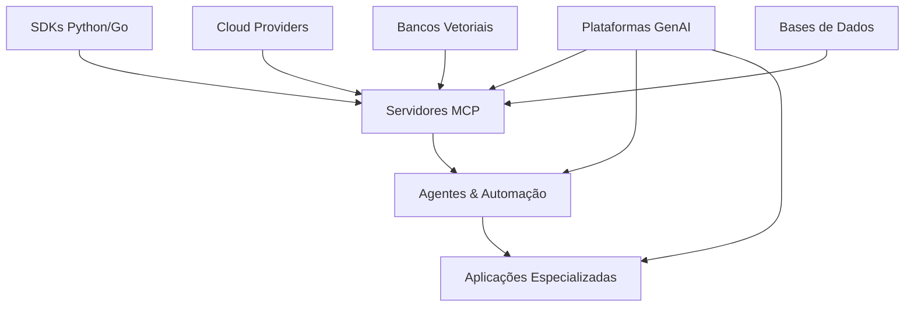

# 🛠️ Tools - Ecossistema Completo de Ferramentas de IA

[](https://github.com/myselfgus/tools)
[](#)
[](#contribuição)

> **Uma coleção abrangente e organizada de ferramentas, SDKs e aplicações para desenvolvimento com IA, protocolos MCP e automação inteligente.**

## 📋 Índice

- [🎯 Visão Geral](#-visão-geral)
- [🚀 Início Rápido](#-início-rápido)
- [📂 Categorias de Ferramentas](#-categorias-de-ferramentas)
  - [🔌 Servidores MCP & Protocolos](#-servidores-mcp--protocolos)
  - [🤖 Plataformas GenAI & IA](#-plataformas-genai--ia)
  - [⚙️ SDKs & Desenvolvimento](#️-sdks--desenvolvimento)
  - [🎯 Agentes & Automação](#-agentes--automação)
  - [🏥 Aplicações Especializadas](#-aplicações-especializadas)
- [🔗 Integrações e Conexões](#-integrações-e-conexões)
- [📖 Exemplos de Uso](#-exemplos-de-uso)
- [🤝 Contribuição](#-contribuição)
- [📞 Suporte](#-suporte)

---

## 🎯 Visão Geral

Este repositório representa um **ecossistema integrado** de ferramentas modernas para desenvolvimento com inteligência artificial, organizado em categorias que facilitam a descoberta, utilização e integração entre diferentes componentes.

### ✨ Características Principais

- **🔄 Interoperabilidade**: Ferramentas projetadas para funcionar em conjunto
- **📡 Protocolo MCP**: Suporte nativo ao Model Context Protocol
- **🚀 GenAI Ready**: Integração com as principais plataformas de IA
- **⚡ Desenvolvimento Ágil**: SDKs e templates para prototipagem rápida
- **🎯 Especialização**: Soluções verticais para casos específicos

---

## 🚀 Início Rápido

### Pré-requisitos

```bash
# Node.js (para ferramentas JavaScript/TypeScript)
node --version

# Python (para ferramentas Python)
python --version

# Go (para ferramentas Go)
go version
```

### Instalação Básica

```bash
# Clone o repositório
git clone https://github.com/myselfgus/tools.git
cd tools

# Explore uma categoria específica
cd [01-05]-[categoria]

# Explore uma ferramenta específica
cd [01-05]-[categoria]/[nome-da-ferramenta]
```

### Estrutura Organizada

```
tools/
├── 01-servidores-mcp-protocolos/     # Infraestrutura MCP
├── 02-plataformas-genai-ia/          # Plataformas GenAI
├── 03-sdks-desenvolvimento/          # SDKs & Frameworks  
├── 04-agentes-automacao/             # Agentes & Automação
├── 05-aplicacoes-especializadas/     # Apps Especializadas
├── README.md                         # Este documento
├── NAVIGATION.md                     # Guia de navegação
└── CONTRIBUTING.md                   # Guia de contribuição
```

---

## 📂 Categorias de Ferramentas

### 🔌 Servidores MCP & Protocolos
📁 **Localização**: `01-servidores-mcp-protocolos/`

> **Infraestrutura de comunicação e protocolos para integração de modelos**

Esta categoria inclui ferramentas fundamentais para implementação do Model Context Protocol (MCP) e comunicação entre diferentes sistemas de IA.

#### 🛠️ Ferramentas Disponíveis

| Ferramenta | Descrição | Status | Linguagem |
|------------|-----------|--------|-----------|
| **A2A-MCP-Server** | Servidor MCP para comunicação Agent-to-Agent | 🔧 *Desenvolvimento* | - |
| **AllVoiceLab-MCP** | Integração MCP para processamento de voz | 🔧 *Desenvolvimento* | - |
| **MCP-Server-Creator** | Gerador automatizado de servidores MCP | 🔧 *Desenvolvimento* | - |
| **brlaw_mcp_server** | Servidor MCP especializado em direito brasileiro | 🔧 *Desenvolvimento* | - |
| **chat-mcp** | Servidor MCP para sistemas de chat | 🔧 *Desenvolvimento* | - |
| **chroma-mcp** | Integração MCP com banco vetorial Chroma | 🔧 *Desenvolvimento* | - |
| **chronulus-mcp** | Servidor MCP para gestão temporal | 🔧 *Desenvolvimento* | - |
| **cloud-run-mcp** | Deploy MCP no Google Cloud Run | 🔧 *Desenvolvimento* | - |
| **github-enterprise-mcp** | MCP para GitHub Enterprise | 🔧 *Desenvolvimento* | - |
| **mcp-cli-host** | Host CLI para servidores MCP | 🔧 *Desenvolvimento* | - |
| **mcp-create** | Template creator para projetos MCP | 🔧 *Desenvolvimento* | - |
| **mcp-discovery** | Descoberta automática de serviços MCP | 🔧 *Desenvolvimento* | - |
| **mcp-language-server** | Language Server Protocol para MCP | 🔧 *Desenvolvimento* | - |
| **mcp-mcp** | Meta-servidor MCP | 🔧 *Desenvolvimento* | - |
| **mcp-proxy** | Proxy para servidores MCP | 🔧 *Desenvolvimento* | - |
| **mcp-redis** | Integração MCP com Redis | 🔧 *Desenvolvimento* | - |
| **mongodb-mcp-server** | Servidor MCP para MongoDB | 🔧 *Desenvolvimento* | - |
| **pinecone-mcp** | Integração MCP com Pinecone | 🔧 *Desenvolvimento* | - |

#### 🔗 Capacidades de Integração

- **Comunicação Inter-Agentes**: Protocolos A2A para coordenação de múltiplos agentes
- **Bancos Vetoriais**: Integração nativa com Chroma, Pinecone
- **Persistência**: Suporte a Redis, MongoDB
- **Cloud Native**: Deploy automatizado em Google Cloud Run
- **Desenvolvimento**: Templates e discovery automático

### 🤖 Plataformas GenAI & IA
📁 **Localização**: `02-plataformas-genai-ia/`

> **Ferramentas e plataformas para desenvolvimento com IA generativa**

Soluções completas para construção, deploy e gestão de aplicações baseadas em IA generativa.

#### 🛠️ Ferramentas Disponíveis

| Ferramenta | Descrição | Status | Linguagem |
|------------|-----------|--------|-----------|
| **genai-toolbox** | Caixa de ferramentas para GenAI | 🔧 *Desenvolvimento* | - |
| **genai-factory** | Fábrica de modelos generativos | 🔧 *Desenvolvimento* | - |
| **generative-ai** | Framework principal para IA generativa | 🔧 *Desenvolvimento* | - |
| **genkit-intro** | Introdução ao Google Genkit | ✅ *Ativo* | Go |
| **vertex-ai-samples** | Exemplos para Google Vertex AI | 🔧 *Desenvolvimento* | - |
| **deepseek-mcp-server** | Servidor MCP para DeepSeek | 🔧 *Desenvolvimento* | - |
| **deepseek-thinker-mcp** | MCP para DeepSeek Thinker | 🔧 *Desenvolvimento* | - |
| **cognee** | Plataforma de cognição artificial | 🔧 *Desenvolvimento* | - |

#### 🔗 Capacidades de Integração

- **Multi-Provider**: Suporte a Google (Vertex AI, Genkit), DeepSeek
- **Cognitive Computing**: Processamento cognitivo avançado
- **Model Factory**: Criação e gestão automatizada de modelos
- **Enterprise Ready**: Soluções para ambientes corporativos

### ⚙️ SDKs & Desenvolvimento
📁 **Localização**: `03-sdks-desenvolvimento/`

> **Kits de desenvolvimento e frameworks para diferentes linguagens**

Ferramentas fundamentais para desenvolvimento de aplicações integradas ao ecossistema.

#### 🛠️ Ferramentas Disponíveis

| Ferramenta | Descrição | Status | Linguagem |
|------------|-----------|--------|-----------|
| **python-sdk** | SDK principal em Python | 🔧 *Desenvolvimento* | Python |
| **go-sdk** | SDK principal em Go | 🔧 *Desenvolvimento* | Go |
| **golang-samples** | Exemplos e templates Go | 🔧 *Desenvolvimento* | Go |
| **code-assistant** | Assistente de código IA | 🔧 *Desenvolvimento* | - |
| **fastmcp** | Framework rápido para MCP | 🔧 *Desenvolvimento* | - |
| **use-mcp** | Utilitários para uso de MCP | 🔧 *Desenvolvimento* | - |

#### 🔗 Capacidades de Integração

- **Multi-Language**: Suporte completo para Python e Go
- **Code Intelligence**: Assistência automatizada de código
- **Rapid Prototyping**: Templates e frameworks ágeis
- **MCP Native**: Integração nativa com protocolos MCP

### 🎯 Agentes & Automação
📁 **Localização**: `04-agentes-automacao/`

> **Sistemas de agentes inteligentes e automação**

Plataformas para criação, gestão e orquestração de agentes autônomos.

#### 🛠️ Ferramentas Disponíveis

| Ferramenta | Descrição | Status | Linguagem |
|------------|-----------|--------|-----------|
| **agent-starter-pack** | Template inicial para agentes | 🔧 *Desenvolvimento* | - |
| **fast-agent** | Framework ágil para agentes | 🔧 *Desenvolvimento* | - |
| **ops-agent** | Agente para operações DevOps | 🔧 *Desenvolvimento* | - |
| **workloadagentplatform** | Plataforma de agentes para workloads | 🔧 *Desenvolvimento* | - |
| **MCP-Developer-SubAgent** | Sub-agente especializado para desenvolvimento | 🔧 *Desenvolvimento* | - |
| **claude-thread-continuity** | Continuidade de conversas Claude | 🔧 *Desenvolvimento* | - |
| **computer-control-mcp** | Controle de computador via MCP | 🔧 *Desenvolvimento* | - |
| **extended-memory-mcp** | Memória estendida para agentes | 🔧 *Desenvolvimento* | - |

#### 🔗 Capacidades de Integração

- **Multi-Agent Systems**: Coordenação entre múltiplos agentes
- **Memory Management**: Sistemas de memória persistente e estendida
- **DevOps Integration**: Automação de operações e deploy
- **Computer Control**: Controle direto de sistemas computacionais

### 🏥 Aplicações Especializadas
📁 **Localização**: `05-aplicacoes-especializadas/`

> **Soluções verticais para casos de uso específicos**

Aplicações completas para domínios específicos como saúde, direito e outras áreas especializadas.

#### 🛠️ Ferramentas Disponíveis

| Ferramenta | Descrição | Status | Linguagem |
|------------|-----------|--------|-----------|
| **healthcare** | Soluções para área da saúde | 🔧 *Desenvolvimento* | - |
| **page_voither** | Landing page VOITHER MedicalScribe | ✅ *Ativo* | TypeScript |
| **biomcp** | Protocolo MCP para bioinformática | 🔧 *Desenvolvimento* | - |
| **sqlite-literature-management-fastmcp-mcp-server** | Gestão de literatura científica | 🔧 *Desenvolvimento* | - |
| **genai-databases-retrieval-app** | App de recuperação de bancos GenAI | 🔧 *Desenvolvimento* | - |
| **accelerated-platforms** | Plataformas aceleradas | 🔧 *Desenvolvimento* | - |

#### 🔗 Capacidades de Integração

- **Healthcare AI**: Documentação clínica automatizada (VOITHER MedicalScribe)
- **Bioinformatics**: Processamento de dados biológicos
- **Scientific Literature**: Gestão e análise de publicações
- **Accelerated Computing**: Plataformas otimizadas para performance

---

## 🔗 Integrações e Conexões

### 🔄 Fluxos de Integração Principais



### 🎯 Casos de Uso Integrados

1. **Pipeline Healthcare Completo**
   ```
   02-plataformas-genai-ia/genkit-intro → 05-aplicacoes-especializadas/healthcare → 05-aplicacoes-especializadas/page_voither → 05-aplicacoes-especializadas/biomcp
   ```

2. **Desenvolvimento de Agentes MCP**
   ```
   03-sdks-desenvolvimento/python-sdk → 01-servidores-mcp-protocolos/mcp-create → 04-agentes-automacao/agent-starter-pack → 04-agentes-automacao/ops-agent
   ```

3. **Plataforma GenAI Enterprise**
   ```
   02-plataformas-genai-ia/vertex-ai-samples → 02-plataformas-genai-ia/genai-factory → 01-servidores-mcp-protocolos/cloud-run-mcp → 01-servidores-mcp-protocolos/github-enterprise-mcp
   ```

---

## 📖 Exemplos de Uso

### 🚀 Criando um Agente MCP Básico

```bash
# 1. Usar o template de criação
cd 01-servidores-mcp-protocolos/mcp-create
npm run create-agent my-agent

# 2. Desenvolver com SDK
cd ../../03-sdks-desenvolvimento/python-sdk
pip install -r requirements.txt

# 3. Deploy na nuvem
cd ../../01-servidores-mcp-protocolos/cloud-run-mcp
gcloud run deploy my-agent
```

### 🤖 Integrando GenAI com Healthcare

```bash
# 1. Configurar Genkit
cd 02-plataformas-genai-ia/genkit-intro
go mod tidy && go run main.go

# 2. Configurar aplicação healthcare
cd ../../05-aplicacoes-especializadas/healthcare
npm install && npm run dev

# 3. Conectar com VOITHER
cd ../page_voither
npm install && npm run build
```

---

## 🤝 Contribuição

### 📋 Como Contribuir

1. **Fork** o repositório
2. **Crie** uma branch para sua feature: `git checkout -b feature/nova-ferramenta`
3. **Commit** suas mudanças: `git commit -m 'Adiciona nova ferramenta'`
4. **Push** para a branch: `git push origin feature/nova-ferramenta`
5. **Abra** um Pull Request

### 🏗️ Adicionando Nova Ferramenta

```bash
# 1. Criar diretório da ferramenta
mkdir minha-nova-ferramenta
cd minha-nova-ferramenta

# 2. Adicionar documentação
echo "# Minha Nova Ferramenta" > README.md

# 3. Configurar dependências
# (package.json, requirements.txt, go.mod, etc.)

# 4. Atualizar README principal
# Adicionar na categoria apropriada
```

### 📝 Diretrizes

- ✅ **Documentação**: Toda ferramenta deve ter README próprio
- ✅ **Categorização**: Seguir a estrutura de categorias existente
- ✅ **Integração**: Considerar pontos de integração com outras ferramentas
- ✅ **Testes**: Incluir testes quando aplicável
- ✅ **Licença**: Manter compatibilidade de licenças

---

## 📞 Suporte

### 🆘 Obtendo Ajuda

- **📝 Issues**: [GitHub Issues](https://github.com/myselfgus/tools/issues)
- **💬 Discussões**: [GitHub Discussions](https://github.com/myselfgus/tools/discussions)
- **📧 Email**: [Contato direto](mailto:support@tools.dev)

### 📚 Recursos Adicionais

- **📖 Documentação**: [Wiki do projeto](https://github.com/myselfgus/tools/wiki)
- **🎓 Tutoriais**: [Guias passo-a-passo](https://github.com/myselfgus/tools/wiki/tutorials)
- **🔧 Exemplos**: [Repositório de exemplos](https://github.com/myselfgus/tools-examples)

---

## 📄 Licença

Este projeto está licenciado sob a Licença MIT - veja o arquivo [LICENSE](LICENSE) para detalhes.

---

<div align="center">

**Feito com ❤️ pela comunidade Tools**

[](https://github.com/myselfgus/tools)
[](https://github.com/myselfgus/tools)

</div>